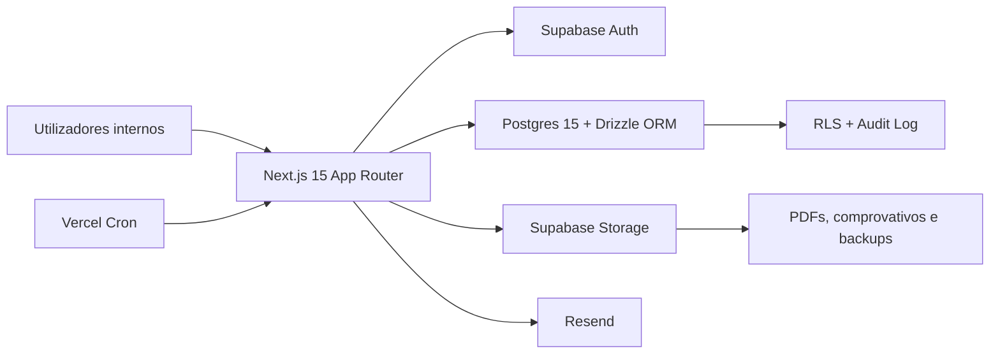
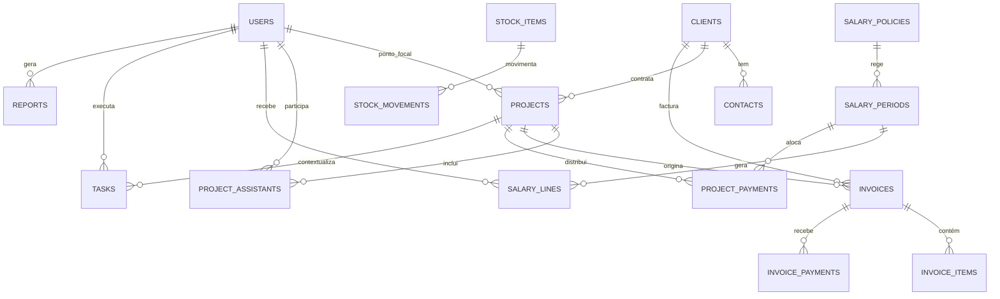

# ABIPTOM Admin

## Visão Geral

`abiptom-admin` é a plataforma interna de gestão administrativa, financeira e operacional da ABIPTOM SARL. A aplicação centraliza autenticação, utilizadores, clientes, projectos, facturação, folha salarial, despesas, dividendos, tarefas, stock e relatórios mensais num único backoffice.

O produto foi desenhado para profissionalizar o fecho mensal da empresa, reduzir dependência de processos dispersos e dar visibilidade operacional e financeira em tempo real. O foco não é apenas gestão interna. É também consistência, rastreabilidade, controlo de risco e capacidade de escalar operação com disciplina.

[Ver versão publicada](https://abiptom-admin.vercel.app)

**Proposta de valor**
- centraliza fluxos críticos de administração, operação e finanças
- reduz erro manual em facturação, salários, despesas e reporting
- reforça governação com MFA, RBAC, RLS e audit log
- prepara a ABIPTOM para operar com mais previsibilidade e mais maturidade interna

**Perfis suportados**
- `ca` para Conselho de Administração
- `dg` para Director Geral
- `coord` para coordenação operacional
- `staff` para colaboradores com acesso apenas aos seus próprios dados

**Módulos principais**
- painel administrativo com KPIs mensais
- gestão de utilizadores com RBAC e MFA
- clientes, contactos, projectos e facturas
- processamento salarial, recibos e histórico individual
- despesas, dividendos, tarefas e stock
- relatório mensal P&L com exportação
- cron jobs para relatório automático e backup

> Screenshots capturados no ambiente local com dados de seed.

| Login | Painel administrativo |
| --- | --- |
|  |  |

| Clientes | Relatório mensal |
| --- | --- |
|  |  |

## Estratégia

### Objectivos do projecto

- concentrar o fluxo mensal da ABIPTOM numa única aplicação interna
- reduzir dependência de folhas soltas, ficheiros paralelos e processos manuais
- aplicar fronteiras fortes de segurança entre CA, DG, coordenação e staff
- produzir artefactos formais, como PDF de facturas e recibos, com consistência visual
- disponibilizar relatórios operacionais e financeiros exportáveis
- manter uma base técnica preparada para evoluir com mais automação e validação

## Histórias de Utilizador

### Autenticação e controlo de acesso

Como **CA ou DG** quero **autenticação com MFA e controlo por papel** para **proteger áreas críticas da plataforma**.

#### Critérios de aceitação
- o login é validado no servidor através de Supabase Auth
- CA e DG são redireccionados para configuração de MFA quando necessário
- o middleware bloqueia acesso a rotas fora do papel do utilizador
- staff e coordenação não conseguem navegar nem consultar áreas administrativas restritas

### Gestão de utilizadores

Como **CA ou DG** quero **criar, editar e desactivar utilizadores** para **controlar a equipa e as permissões internas**.

#### Critérios de aceitação
- a criação de utilizadores é feita com cliente admin server-side
- a actualização sincroniza a tabela `users` e os metadados de auth
- a desactivação impede acesso futuro sem apagar histórico operacional
- mutações sensíveis geram registos em `audit_log`

### Clientes, contactos e facturação

Como **DG ou coordenação** quero **gerir clientes, contactos, projectos e facturas** para **acompanhar a operação comercial de ponta a ponta**.

#### Critérios de aceitação
- o sistema suporta CRUD de clientes, contactos e projectos
- facturas podem evoluir entre `rascunho`, `proforma`, `definitiva`, `paga_parcial`, `paga` e `anulada`
- PDFs são gerados server-side e podem ser descarregados a partir da aplicação
- existe exportação mensal de facturas em Excel

### Folha salarial e RH

Como **CA ou DG** quero **processar períodos salariais e emitir recibos** para **fechar a folha com rastreabilidade**.

#### Critérios de aceitação
- o sistema suporta políticas salariais e períodos mensais
- cada período gera linhas salariais e pagamentos por projecto
- recibos individuais podem ser consultados em PDF
- o staff vê apenas o seu histórico e os seus recibos

### Área pessoal do colaborador

Como **staff** quero **consultar os meus projectos, salário e tarefas** para **acompanhar o meu trabalho sem depender da administração**.

#### Critérios de aceitação
- existe dashboard pessoal com visão resumida do colaborador
- o colaborador vê o histórico salarial e as alocações por projecto
- o colaborador vê apenas tarefas que lhe pertencem
- o acesso é protegido por RLS e não depende apenas de checks na UI

### Despesas, dividendos, stock e tarefas

Como **equipa administrativa** quero **registar operação corrente e distribuição financeira** para **ter controlo do negócio num único sítio**.

#### Critérios de aceitação
- despesas podem ser registadas e classificadas por categoria
- dividendos podem ser processados e acompanhados por período
- stock suporta itens e movimentos de entrada, saída e ajuste
- tarefas podem ser atribuídas, acompanhadas e concluídas por estado

### Relatórios e operação contínua

Como **CA ou DG** quero **relatórios mensais e backups automáticos** para **ter visibilidade financeira e continuidade operacional**.

#### Critérios de aceitação
- o relatório mensal P&L pode ser gerado sob demanda e por cron
- os cron jobs exigem `CRON_SECRET` em produção
- os backups são enviados para bucket privado no Supabase Storage
- a aplicação continua a gerar backup mesmo sem `pg_dump`, usando fallback SQL server-side

## Estrutura da Solução

### Arquitectura da aplicação



### Esquema de dados



### Domínios principais

<details>
<summary>Identidade e acessos</summary>

- `users` liga o utilizador aplicacional a `auth.users`
- o papel é usado no middleware para navegação e na base de dados para RLS
- `audit_log` regista mutações sensíveis e permite rastreabilidade
- `setup-mfa` cobre o fluxo de MFA para perfis críticos

</details>

<details>
<summary>Clientes, projectos e facturação</summary>

- `clients` e `contacts` mantêm a base comercial
- `projects` e `project_assistants` modelam responsabilidade e equipa operacional
- `invoices`, `invoice_items` e `invoice_payments` cobrem emissão, detalhe e recebimentos
- PDFs de factura e exportação Excel são gerados no servidor

</details>

<details>
<summary>Folha salarial e RH</summary>

- `salary_policies` define a política em vigor por período
- `salary_periods`, `salary_lines` e `project_payments` suportam cálculo, validação e pagamento
- recibos em PDF podem ser consultados pela administração e pelo próprio colaborador
- há páginas staff para dashboard, projectos, tarefas e histórico salarial

</details>

<details>
<summary>Operação e reporting</summary>

- `expenses`, `dividend_periods` e `dividend_lines` suportam controlo financeiro complementar
- `tasks` permite organização operacional simples por estado, prioridade e responsável
- `stock_items` e `stock_movements` suportam controlo básico de inventário
- `reports` guarda relatórios consolidados e metadados de geração

</details>

## Funcionalidades implementadas

- autenticação com Supabase e controlo de acesso por papel
- MFA obrigatório para CA e DG
- CRUD de utilizadores, clientes, projectos, despesas, tarefas e stock
- facturas com PDF, pagamentos e exportação mensal
- folha salarial com políticas, períodos e recibos PDF
- dividendos por período e linhas individuais
- área pessoal para staff com dashboard, tarefas, projectos e histórico salarial
- relatório mensal P&L com exportação PDF
- cron mensal para geração de relatório e cron diário para backup

## Segurança

- autenticação verificada server-side em rotas e server actions
- Row Level Security activa nas áreas sensíveis, incluindo `tasks`, `reports`, `stock_items` e `stock_movements`
- uso de `SUPABASE_SERVICE_ROLE_KEY` apenas em contexto server-side estritamente necessário
- `CRON_SECRET` para proteger invocações de cron em produção
- bucket de backups privado no Supabase Storage
- MFA obrigatório para perfis de risco mais elevado
- isolamento de dados do staff validado por testes E2E

## Stack Tecnológica

| Camada | Tecnologia |
| --- | --- |
| Frontend | Next.js 15, App Router, React 19, TypeScript |
| UI | Tailwind CSS, componentes utilitários locais, Lucide |
| Base de dados | Supabase Postgres 15 |
| ORM | Drizzle ORM + migrations versionadas |
| Auth | Supabase Auth |
| Storage | Supabase Storage |
| Email | Resend |
| PDF | `@react-pdf/renderer` |
| Exportação | `xlsx` |
| Testes unitários | Vitest |
| Testes E2E | Playwright |
| Deploy | Vercel |

## Estrutura do projecto

```text
abiptom-admin/
├── public/
│   ├── brand/
│   └── readme/
├── src/
│   ├── app/
│   │   ├── (auth)/
│   │   ├── admin/
│   │   ├── api/
│   │   └── staff/
│   ├── components/
│   └── lib/
│       ├── auth/
│       ├── backup/
│       ├── cron/
│       ├── db/
│       ├── pdf/
│       ├── reports/
│       ├── salary/
│       ├── stock/
│       └── tasks/
├── tests/
│   └── e2e/
├── drizzle.config.ts
├── playwright.config.ts
├── vercel.json
└── README.md
```

## Configuração local

### Pré-requisitos

- Node.js 20+
- npm 10+
- projecto Supabase configurado
- bucket privado de backups criado no Supabase Storage, por exemplo `backups`

### Instalação

```bash
npm install
```

### Variáveis de ambiente

Cria um ficheiro `.env.local` com as variáveis necessárias para o teu ambiente.

| Variável | Obrigatória | Descrição |
| --- | --- | --- |
| `NEXT_PUBLIC_SUPABASE_URL` | Sim | URL pública do projecto Supabase |
| `NEXT_PUBLIC_SUPABASE_ANON_KEY` | Sim | Chave anónima usada pelo cliente web |
| `SUPABASE_SERVICE_ROLE_KEY` | Sim | Chave administrativa usada apenas server-side |
| `DATABASE_URL` | Sim | Ligação Postgres de runtime. Em Vercel deve ser a string Supavisor transaction mode `*.pooler.supabase.com:6543` |
| `DATABASE_DIRECT_URL` | Opcional | Ligação directa IPv6 da Supabase, útil para scripts locais, migrations e acessos directos |
| `RESEND_API_KEY` | Sim | Chave da API Resend para envio de email |
| `RESEND_FROM` | Sim | Endereço remetente usado nos emails |
| `CRON_SECRET` | Sim em produção | Segredo usado para autenticar cron jobs |
| `BACKUP_SUPABASE_BUCKET` | Sim para backup remoto | Nome do bucket privado de backup, por exemplo `backups` |
| `E2E_CA_EMAIL` | Opcional | Conta CA usada pela suite E2E |
| `E2E_CA_PASSWORD` | Opcional | Password da conta CA E2E |
| `E2E_DG_EMAIL` | Opcional | Conta DG usada pela suite E2E |
| `E2E_DG_PASSWORD` | Opcional | Password da conta DG E2E |
| `E2E_STAFF_EMAIL` | Opcional | Conta staff usada pela suite E2E |
| `E2E_STAFF_PASSWORD` | Opcional | Password da conta staff E2E |
| `PLAYWRIGHT_BASE_URL` | Opcional | URL base alternativa para Playwright |

### Base de dados

Aplicar migrations:

```bash
npm run db:migrate
```

Seed opcional para ambiente de desenvolvimento:

```bash
npm run db:seed
```

### Desenvolvimento

```bash
npm run dev
```

Aplicação disponível em `http://localhost:3000`.

### Nota importante para Vercel e Supabase

Se estiveres a usar Supabase, não coloques em produção a connection string directa `db.<project-ref>.supabase.co:5432` como `DATABASE_URL` no Vercel. Essa ligação depende de IPv6 e a própria documentação da Supabase lista a Vercel como ambiente IPv4-only.

Configuração recomendada:
- `DATABASE_URL` no Vercel: Supavisor transaction mode `*.pooler.supabase.com:6543`
- `DATABASE_DIRECT_URL` local ou opcional: ligação directa `db.<project-ref>.supabase.co:5432`

Passos:
1. abrir o projecto na Supabase
2. clicar em `Connect`
3. copiar a connection string `Supavisor transaction mode`
4. substituir `DATABASE_URL` no Vercel por essa string
5. fazer redeploy

## Scripts úteis

| Script | Descrição |
| --- | --- |
| `npm run dev` | arranca o servidor de desenvolvimento |
| `npm run build` | gera build de produção |
| `npm run start` | serve a build de produção |
| `npm run lint` | executa ESLint |
| `npm run db:generate` | gera migrations Drizzle |
| `npm run db:migrate` | aplica migrations |
| `npm run db:push` | sincroniza schema directamente com a base de dados |
| `npm run db:seed` | corre seed inicial |
| `npm run test` | corre Vitest |
| `npm run test:e2e` | corre a suite Playwright |

## Testes e qualidade

### Verificações recomendadas

```bash
npm run lint
npx tsc --noEmit
npm run test
npm run test:e2e
```

### Suite E2E

A suite Playwright faz bootstrap automático de utilizadores de teste no Supabase antes de arrancar. O `globalSetup` sincroniza as contas E2E em `auth.users` e na tabela `public.users`, para que os fluxos críticos sejam reproduzíveis.

Fluxos actualmente cobertos:
- login e erro de autenticação
- login de staff sem MFA
- RBAC entre staff e área admin
- logout
- acesso DG à gestão de utilizadores
- criação de utilizador staff
- isolamento de dados via API

## Cron jobs e operação

### Relatório mensal
- rota: `/api/cron/monthly-report`
- autenticação: `Authorization: Bearer <CRON_SECRET>` em produção
- agendamento actual: dia 5 de cada mês às 06:00, definido em `vercel.json`

### Backup diário
- rota: `/api/cron/backup`
- autenticação: `Authorization: Bearer <CRON_SECRET>` em produção
- agendamento actual: diariamente às 03:00, definido em `vercel.json`
- destino: bucket privado configurado em `BACKUP_SUPABASE_BUCKET`
- fallback: se o runtime não tiver `pg_dump`, a aplicação gera um dump SQL server-side para manter o backup operacional

## Deploy

O projecto está preparado para deploy em Vercel com Supabase remoto.

Ambiente público actual:
- [https://abiptom-admin.vercel.app](https://abiptom-admin.vercel.app)

### Checklist mínimo de produção

- configurar todas as variáveis de ambiente no Vercel
- garantir que `SUPABASE_SERVICE_ROLE_KEY` existe apenas no servidor
- configurar `DATABASE_URL` com a string Supavisor transaction mode da Supabase
- manter `DATABASE_DIRECT_URL` apenas para uso local ou ferramentas que suportem IPv6
- criar bucket privado de backups no Supabase Storage
- definir `BACKUP_SUPABASE_BUCKET` com o nome exacto do bucket
- definir `CRON_SECRET` com um segredo forte e único
- validar rotas de cron após o deploy
- confirmar que RLS está activa nas tabelas sensíveis

### Troubleshooting de produção

#### Erro `getaddrinfo ENOTFOUND db.<project-ref>.supabase.co`

Isto indica quase sempre que a aplicação em produção está a tentar usar a ligação directa IPv6 da Supabase a partir de um ambiente que não suporta esse caminho de rede.

Correcção:
- trocar `DATABASE_URL` no Vercel para a connection string Supavisor transaction mode
- voltar a fazer deploy

Referência oficial da Supabase:
- a ligação directa da base de dados usa IPv6
- a Vercel é listada como ambiente IPv4-only
- para estes casos deve usar-se o pooler `*.pooler.supabase.com`

#### Utilizador existe no Supabase Auth mas não aparece em `/admin/users`

Sintoma típico:
- o email já existe no painel Auth
- a app mostra `A user with this email address has already been registered`
- o login aceita a password mas o utilizador não entra correctamente na app

Causa:
- a aplicação depende de duas camadas sincronizadas:
  - `auth.users` no Supabase Auth
  - `public.users` na base de dados da aplicação
- criar o utilizador manualmente apenas no painel Auth deixa a conta incompleta

Forma correcta de operar:
- criar utilizadores em `/admin/users/new`
- deixar a app criar a conta Auth e a linha correspondente em `public.users`
- no primeiro acesso, o utilizador define a password via `/forgot-password`

Se já foi criado manualmente no Auth:
- apagar a conta manual em `Authentication > Users`
- verificar se não ficou linha órfã em `public.users`
- recriar o utilizador a partir da app

#### `/forgot-password` envia erro ao pedir link de recuperação

Sintoma típico:
- a conta existe e consegue gerar link de recovery via admin API
- o ecrã de recuperação mostra erro de envio

Causa mais comum:
- o SMTP do `Supabase Auth` não está configurado
- ou o `redirectTo` usado pela app não está incluído nos `Redirect URLs`

Checklist de correcção:
- em `Authentication > URL Configuration`
  - `Site URL = https://abiptom-admin.vercel.app`
  - adicionar:
    - `https://abiptom-admin.vercel.app/**`
    - `https://*-abiptom-6351s-projects.vercel.app/**`
    - `http://localhost:3000/**`
    - `http://localhost:3001/**`
- em `Authentication > SMTP Settings`
  - activar `Custom SMTP`
  - configurar o servidor real de envio, por exemplo cPanel SMTP ou Resend SMTP

Nota:
- `RESEND_FROM` na app não resolve este fluxo
- recuperação de password usa o SMTP configurado dentro do `Supabase Auth`

#### O email chega mas o link acaba em `/login?error=auth-confirm`

Sintoma típico:
- o email é entregue correctamente
- ao clicar no botão, a app volta para login com erro `auth-confirm`

Causa:
- o template `Reset Password` não está a enviar o utilizador para o callback correcto da app
- a página `/auth/confirm` precisa de receber `token_hash` e `type=recovery`

Template recomendado para o botão de reset:

```html
<a href="https://abiptom-admin.vercel.app/auth/confirm?next=/update-password&token_hash={{ .TokenHash }}&type=recovery">
  Definir nova palavra-passe
</a>
```

Resultado esperado:
- o email abre `/auth/confirm`
- a app valida o token
- o utilizador é redireccionado para `/update-password`
- os campos `Nova palavra-passe` e `Confirmar palavra-passe` aparecem na app, não no email

## Estado do produto

O núcleo administrativo da aplicação já cobre os fluxos principais de operação interna da ABIPTOM:
- segurança base com MFA, RBAC e RLS
- facturação e clientes
- projectos e RH
- despesas, dividendos, stock e tarefas
- relatórios mensais e backups
- portal staff para auto-serviço

## Licença

Produto interno e privado da ABIPTOM SARL.
