# ABIPTOM Core

> Os Guardiões das Novas Tecnologias

Última actualização: 4 de Maio de 2026.

`ABIPTOM Core` é a plataforma operacional interna da ABIPTOM SARL. O repositório mantém o nome técnico `abiptom-admin`, mas a aplicação exposta aos utilizadores usa a marca Core. Centraliza clientes, projectos, facturação, despesas, folha salarial, dividendos, stock, tarefas, mensagens internas, relatórios e área pessoal dos colaboradores.

Ambiente público: [https://abiptom-admin.vercel.app](https://abiptom-admin.vercel.app)

## Visão Geral

A plataforma foi desenhada para fechar o ciclo mensal da ABIPTOM com menos erro manual, mais rastreabilidade e melhor controlo de acesso. O foco actual é suportar a operação real da empresa: emitir facturas, registar recebimentos, relacionar projectos e despesas, calcular folha salarial com base nas facturas pagas e produzir relatórios financeiros úteis.

**Objectivos principais**

- centralizar operação administrativa e financeira
- reduzir folhas paralelas e lançamentos manuais duplicados
- manter histórico auditável de alterações sensíveis
- proteger dados por papel, sessão e RLS
- produzir PDFs profissionais com identidade ABIPTOM
- preparar a empresa para reporting financeiro mais consistente

**Perfis suportados**

| Papel | Responsabilidade |
| --- | --- |
| `ca` | Conselho de Administração, acesso total e configuração crítica |
| `dg` | Direcção Geral, gestão operacional e financeira avançada |
| `coord` | Coordenação, operação diária de clientes, projectos, facturas, despesas, stock e tarefas |
| `staff` | Área pessoal, tarefas, projectos e recibos próprios |

## Screenshots

| Login | Painel administrativo |
| --- | --- |
| 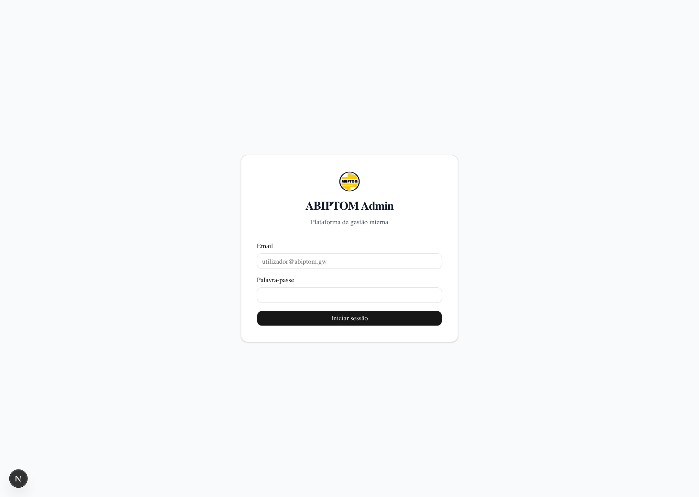 | 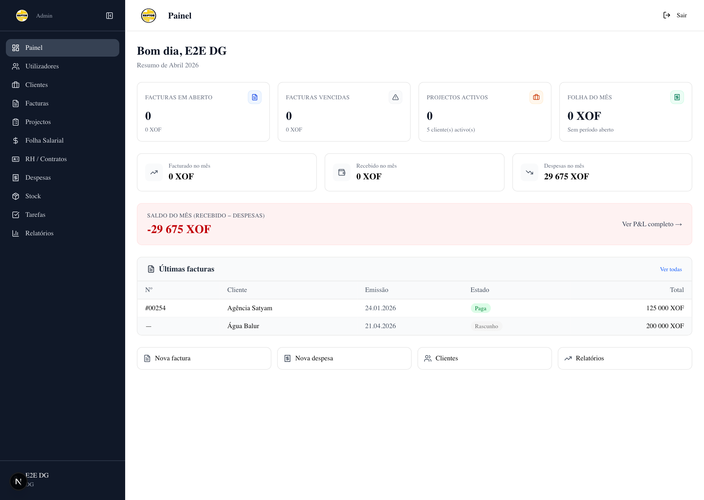 |

| Clientes | Facturas |
| --- | --- |
| 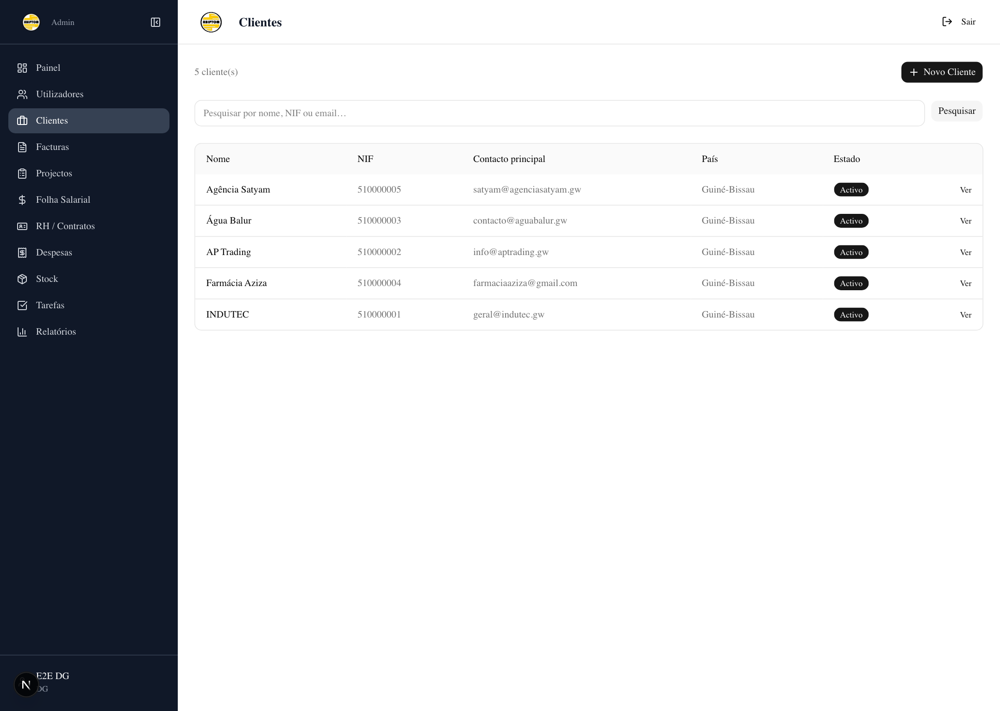 | 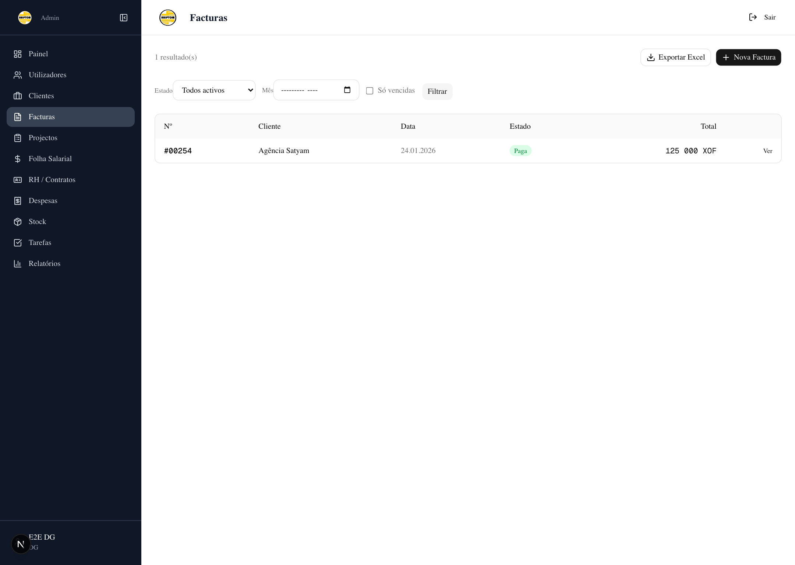 |

| Relatórios | Stock |
| --- | --- |
| 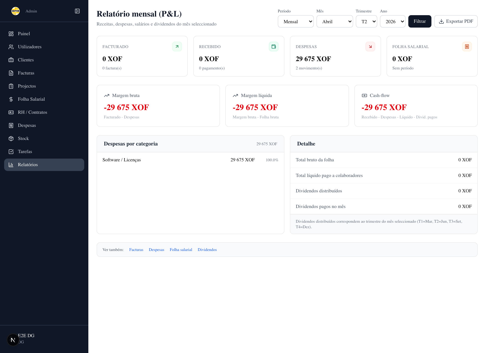 | 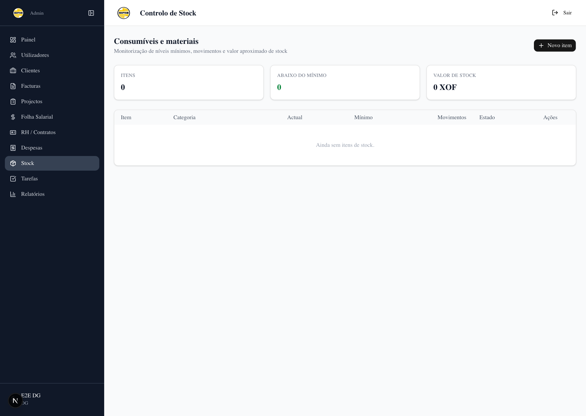 |

| Chat interno | Tarefas |
| --- | --- |
| 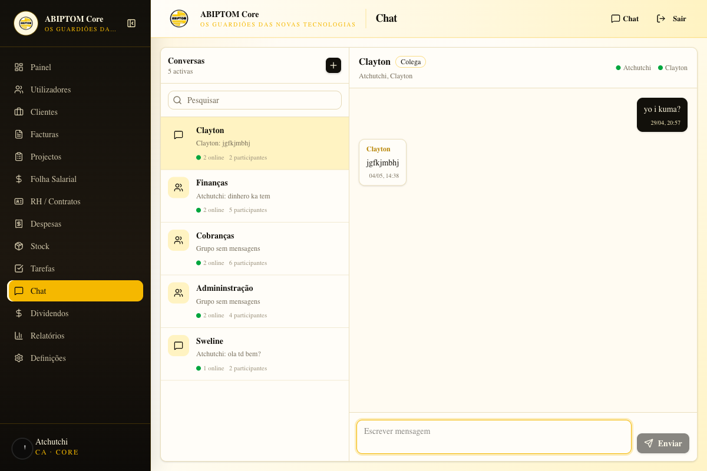 | 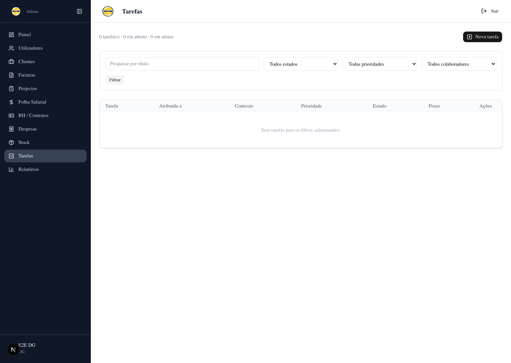 |


## Funcionalidades Implementadas

### Autenticação e segurança

- login com Supabase Auth
- recuperação de palavra-passe com `/forgot-password`, `/auth/confirm` e `/update-password`
- MFA obrigatório para `ca` e `dg`
- middleware com RBAC por rota
- sincronização entre `auth.users` e `public.users`
- reparação automática de ligação Auth quando o email existe nas duas camadas
- perfil pessoal com edição de dados básicos e avatar
- audit log para operações sensíveis

### Utilizadores e equipa

- criação de utilizadores pela aplicação, com conta Supabase Auth e registo interno
- edição de papel, cargo, salário base, desconto sobre folha e elegibilidade a subsídios dinâmicos
- desactivação de utilizadores sem apagar histórico
- eliminação definitiva apenas quando não existem registos dependentes
- bloqueio de auto-desactivação e auto-eliminação
- suporte a fotografia/avatar em perfil

### Clientes, contactos e projectos

- CRUD de clientes e contactos
- projectos com cliente, serviço, ponto focal, auxiliares, estado, valor previsto e moeda
- catálogo de serviços configurável
- dropdown de serviços ajustado para nomes longos
- percentagens por projecto para PF, auxiliares e rubrica de gestão
- relação directa entre projecto, facturas e despesas

### Facturação

- facturas em rascunho, proforma, definitiva, paga parcial, paga e anulada
- numeração automática ao emitir factura
- ligação opcional da factura ao projecto
- itens com quantidade, preço unitário, IGV e moeda
- pagamentos parciais ou totais com data, método, referência e taxa de câmbio
- edição da data de pagamento quando houve erro operacional
- PDF de factura com logotipo e cor dourada ABIPTOM `#F5B800`
- recibo de pagamento em PDF
- envio de factura por email com anexo PDF
- exportação mensal de facturas em Excel

### Despesas

- despesas por categoria, estado, data, fornecedor, moeda e taxa de câmbio
- ligação opcional a projecto para despesas directas do projecto
- ligação opcional a beneficiário para outros benefícios de colaborador
- regra de consistência: uma despesa não pode estar ligada a projecto e beneficiário ao mesmo tempo
- anulação de despesas em vez de eliminação física
- edição e anulação por `ca`, `dg` e `coord`
- edição da data de pagamento
- exclusão de despesas anuladas nos relatórios e cálculos

### Folha salarial

A política activa é `actual_2024`. A política `guia_2026` fica como esqueleto futuro e não deve ser usada ainda em produção.

Funcionalidades actuais:

- criação de período mensal
- snapshot de projectos do período em `salary_period_projects`
- importação de facturas pagas ligadas a projectos
- cálculo a partir de facturas pagas, projectos, auxiliares, despesas directas e participantes
- participantes editáveis por período
- elegibilidade mensal aos subsídios dinâmicos
- escolha livre do beneficiário da rubrica de gestão
- descontos percentuais por colaborador
- outros benefícios vindos de despesas com beneficiário
- anulação de aprovação para corrigir período confirmado
- eliminação de períodos enquanto ainda estão em `aberto` ou `calculado`
- recibos individuais em PDF com branding ABIPTOM
- valores XOF normalizados como inteiros para evitar diferenças como `19 999,99`
- secção informativa de execução validada por projecto
- snapshots mensais de execução em `project_execution_snapshots`
- snapshots mensais de performance por colaborador em `staff_performance_snapshots`
- impacto salarial da execução mantido como informativo nesta fase, sem alterar o cálculo financeiro

Regras operacionais da política `actual_2024`:

- projecto com 1 auxiliar: PF recebe 30%, auxiliares recebem 15% no total, gestão recebe 5%
- projecto com 2 ou mais auxiliares: PF recebe 25%, auxiliares recebem 20% no total, gestão recebe 5%
- sem PF ou sem auxiliares, a parcela não atribuída fica no bolo da empresa
- despesas ligadas ao projecto reduzem a base antes da distribuição salarial do projecto
- despesas com beneficiário entram como outros benefícios da pessoa
- subsídios dinâmicos usam 22% do saldo base e são divididos apenas pelos participantes elegíveis do mês

### Dividendos

- períodos de dividendos por ano e trimestre
- linhas individuais por sócio
- pagamento de dividendos com estado e data
- integração no relatório P&L

### Stock, tarefas e execução validada

- itens de stock com movimentos de entrada, saída e ajuste
- tarefas com responsável, estado, prioridade e contexto operacional
- área staff para tarefas próprias
- entregáveis ponderados por projecto em `/admin/projects/[id]/execution`
- tarefas associadas a entregáveis e peso de execução
- submissão de conclusão pelo colaborador, com comentário e link de evidência opcional
- validação por `ca`, `dg` ou `coord` como `aprovada`, `precisa_correcao` ou `rejeitada`
- pontuação de qualidade de 1 a 5 por validação
- taxa de execução calculada por peso aprovado, não por quantidade simples de tarefas
- tarefas aprovadas continuam compatíveis com o estado legado `concluida`

### Chat interno

- conversas directas entre colegas
- grupos com múltiplos colaboradores
- conversas ligadas a projectos, com participantes derivados do ponto focal e auxiliares
- contador de mensagens não lidas no cabeçalho
- página de chat para administração em `/admin/messages`, com atalho `/admin/chat`
- página de chat para colaboradores em `/staff/me/messages`, com atalho `/staff/me/chat`
- presença online com heartbeat em `user_presence`
- actualização em tempo real via Supabase Realtime para novas mensagens e presença
- fallback de actualização periódica quando o Realtime do browser atrasa ou falha
- composer de mensagem sempre visível no fundo da conversa em desktop
- envio protegido contra falhas da fila de email: a mensagem não falha se a notificação offline falhar
- tratamento explícito de erro no frontend ao criar conversas ou enviar mensagens
- fila de email para destinatários offline em `chat_email_notifications`
- cron `/api/cron/messages-email` diário no plano Hobby da Vercel para enviar notificações pendentes
- deduplicação de emails pendentes por conversa e destinatário
- RLS por participante: só membros da conversa podem ler mensagens e participantes

### Branding e favicon

- favicon ABIPTOM em `src/app/favicon.ico`
- ícone PNG em `src/app/icon.png`
- Apple touch icon em `src/app/apple-icon.png`
- metadata global com ícones explícitos para evitar fallback/cache do ícone da Vercel

### Relatórios

- P&L mensal e trimestral
- acumulado trimestral por mês
- receitas facturadas e recebidas
- despesas por categoria
- folha salarial bruta e líquida
- dividendos pagos
- cashflow e margem
- exportação PDF com cor e identidade ABIPTOM
- cron mensal para geração automática de relatório

### Backups e operação contínua

- cron diário de backup
- protecção por `CRON_SECRET`
- upload para bucket privado Supabase Storage
- fallback SQL quando `pg_dump` não está disponível no runtime

## Fluxo Financeiro Suportado

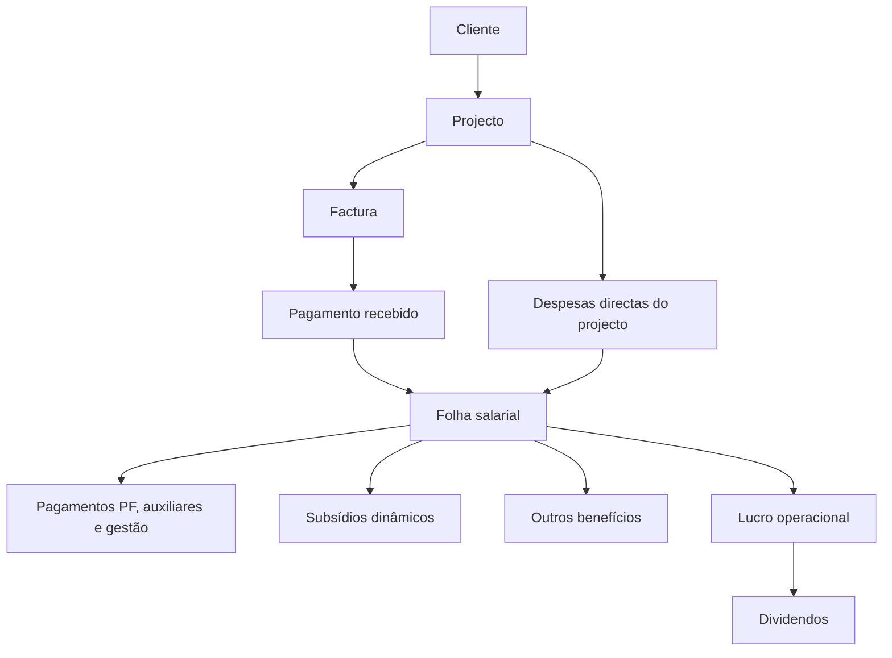

A folha salarial deve usar o valor bruto pago pelo cliente como base do projecto. Se a despesa directa já foi registada e ligada ao projecto, não se deve introduzir manualmente o valor líquido. O motor subtrai essas despesas automaticamente no cálculo.

## Execução e Validação de Tarefas

Funcionalidade implementada na migration `0012_task_execution_validation.sql`.

Objectivo: ligar tarefas, execução operacional, validação da coordenação, taxa de execução do projecto, controlo de RH e impacto salarial. O impacto salarial fica primeiro informativo e só passa a financeiro quando a regra de negócio for aprovada.

### Modelo funcional

- cada projecto passa a ter entregáveis/marcos com peso percentual, por exemplo estratégia 20%, design 30%, campanha 50%
- cada tarefa pertence a um projecto e, opcionalmente, a um entregável
- o colaborador marca a tarefa como `submetida` quando termina
- a coordenação valida como `aprovada`, `rejeitada` ou `precisa_correcao`
- a validação guarda data, validador, comentário, evidência e pontuação de qualidade
- a taxa de execução do projecto é calculada pelo peso das tarefas aprovadas, não apenas por tarefas criadas
- RH vê por colaborador: tarefas atribuídas, submetidas, aprovadas, rejeitadas, atraso médio e qualidade média
- a folha salarial pode usar estes indicadores como factor de elegibilidade, bónus ou bloqueio de pagamento variável

### Estados propostos

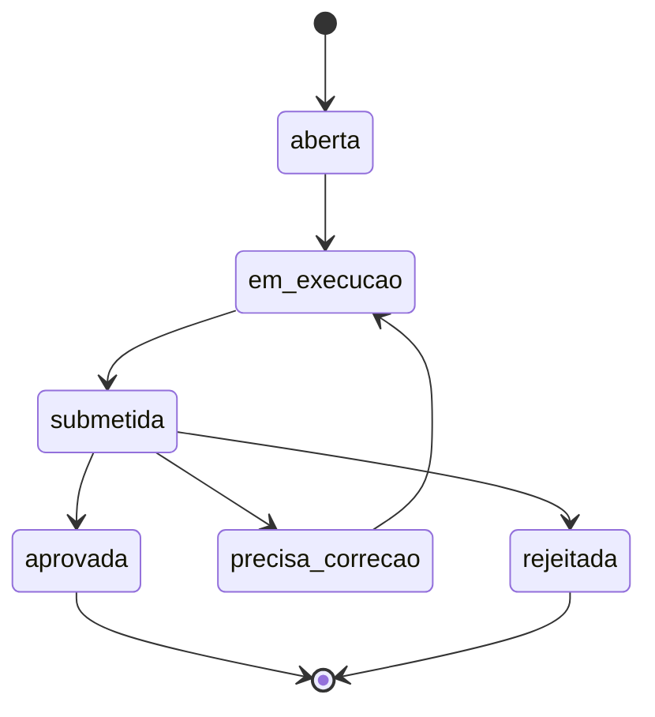

### Tabelas prováveis

- `project_deliverables`: entregáveis por projecto, peso e prazo
- `task_submissions`: submissões do colaborador com descrição, anexos e data
- `task_validations`: decisão da coordenação, nota, comentário e validador
- `project_execution_snapshots`: snapshot mensal da execução usada em relatórios e folha salarial
- `staff_performance_snapshots`: snapshot mensal por colaborador para RH e pagamento

### Regras de cálculo recomendadas

- execução do projecto = soma dos pesos dos entregáveis aprovados
- execução individual = tarefas aprovadas ponderadas pelo peso e prazo
- tarefa atrasada pode reduzir pontuação, mas não deve anular automaticamente trabalho aprovado
- pagamento fixo continua independente da execução, salvo decisão administrativa
- pagamento variável, prémio ou subsídio pode depender de execução aprovada e qualidade mínima
- alterações retroactivas devem gerar snapshot novo, sem apagar o histórico usado numa folha já aprovada

### Fluxo implementado

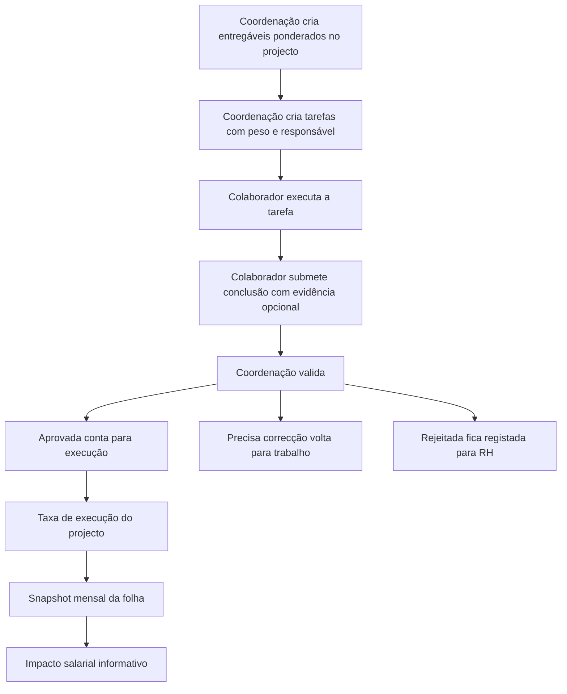

### Onde testar

- `/admin/projects/[id]/execution`: cria e edita entregáveis, acompanha pesos e abre tarefas para validação.
- `/admin/tasks/new`: cria tarefa com projecto, entregável e peso de execução.
- `/staff/me/tasks/[id]`: colaborador submete a conclusão.
- `/admin/tasks/[id]`: coordenação valida a submissão.
- `/admin/salary/[periodId]`: mostra execução live e snapshot mensal por projecto.

### Migration aplicada

Foi adicionada e aplicada a migration `0012_task_execution_validation.sql`.

Cria ou actualiza:

- novos estados em `task_state`: `submetida`, `aprovada`, `precisa_correcao`, `rejeitada`
- enum `project_deliverable_state`
- enum `task_validation_decision`
- colunas em `tasks`: `deliverable_id`, `execution_weight`, `submission_note`, `submitted_at`, `validated_at`, `validated_by`, `quality_score`, `validation_note`
- tabelas `project_deliverables`, `task_submissions`, `task_validations`, `project_execution_snapshots`, `staff_performance_snapshots`
- índices, constraints, RLS e políticas de acesso para equipa, coordenação e snapshots

### Fluxo operacional

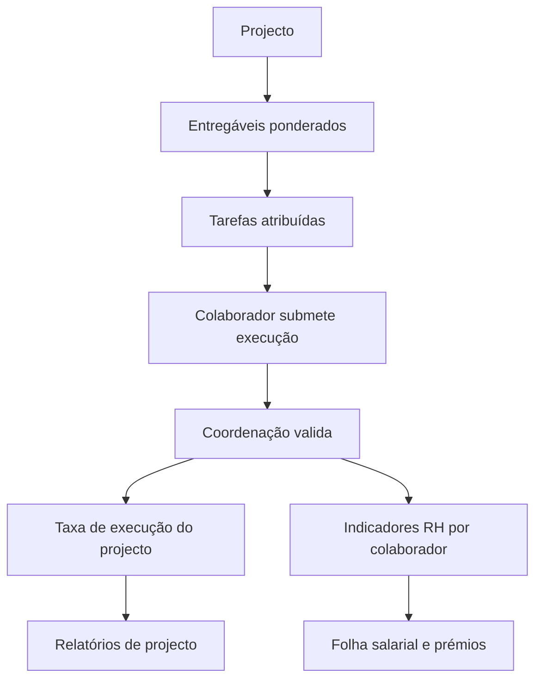

Implementação recomendada em duas fases:

1. fase operacional: submissão, validação, histórico e dashboards
2. fase salarial: integração com snapshots mensais e regras de pagamento variável

## Arquitectura

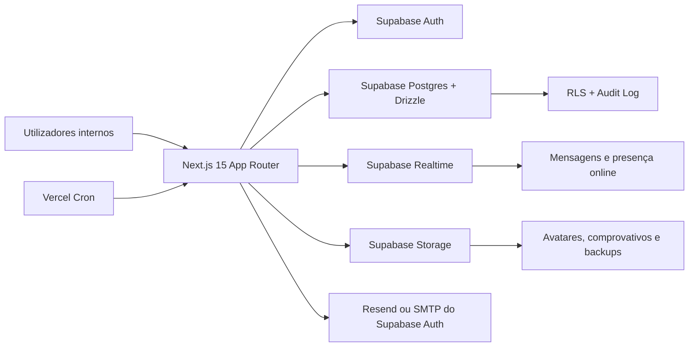

## Stack Tecnológica

| Camada | Tecnologia |
| --- | --- |
| Frontend | Next.js 15, App Router, React 19, TypeScript |
| UI | Tailwind CSS, componentes locais, Lucide |
| Base de dados | Supabase Postgres |
| ORM | Drizzle ORM |
| Auth | Supabase Auth |
| Tempo real | Supabase Realtime |
| Storage | Supabase Storage |
| Email aplicacional | Resend para facturas e notificações de mensagens offline |
| Email Auth | SMTP configurado no Supabase Auth, por exemplo cPanel ou Resend SMTP |
| PDF | `@react-pdf/renderer` |
| Exportação | `xlsx` |
| Testes unitários | Vitest |
| Testes E2E | Playwright |
| Deploy | Vercel |

## Estrutura do Projecto

```text
abiptom-admin/
├── public/
│   ├── brand/
│   └── readme/
├── src/
│   ├── app/
│   │   ├── (auth)/
│   │   ├── admin/
│   │   ├── api/
│   │   └── staff/
│   ├── components/
│   └── lib/
│       ├── auth/
│       ├── backup/
│       ├── cron/
│       ├── db/
│       ├── email/
│       ├── messages/
│       ├── pdf/
│       ├── reports/
│       ├── salary/
│       ├── stock/
│       └── tasks/
├── tests/
├── drizzle.config.ts
├── playwright.config.ts
├── vercel.json
└── README.md
```

## Configuração Local

### Pré-requisitos

- Node.js 20+
- npm 10+
- projecto Supabase configurado
- bucket privado para backups, por exemplo `backups`
- SMTP configurado no Supabase Auth para recuperação de palavra-passe

### Instalação

```bash
npm install
npm run dev
```

A aplicação local fica disponível em `http://localhost:3000` ou noutra porta livre escolhida pelo Next.js.

### Variáveis de ambiente

Criar `.env.local` com as variáveis do ambiente.

| Variável | Obrigatória | Descrição |
| --- | --- | --- |
| `NEXT_PUBLIC_SUPABASE_URL` | Sim | URL pública do projecto Supabase |
| `NEXT_PUBLIC_SUPABASE_ANON_KEY` | Sim | Chave anónima usada pelo cliente web |
| `SUPABASE_SERVICE_ROLE_KEY` | Sim | Chave administrativa usada apenas server-side |
| `DATABASE_URL` | Sim | Ligação Postgres de runtime. Em Vercel deve ser Supavisor transaction mode `*.pooler.supabase.com:6543` |
| `DATABASE_DIRECT_URL` | Opcional | Ligação directa para scripts, migrations e ferramentas locais |
| `NEXT_PUBLIC_SITE_URL` | Recomendado | URL canónico da app, por exemplo `https://abiptom-admin.vercel.app` |
| `RESEND_API_KEY` | Sim para email de facturas | Chave da API Resend |
| `RESEND_FROM` | Sim para email de facturas e mensagens offline | Remetente, por exemplo `ABIPTOM SARL <info@abiptom.gw>` |
| `CRON_SECRET` | Sim em produção | Segredo para cron jobs |
| `BACKUP_SUPABASE_BUCKET` | Sim para backup remoto | Bucket privado para backups |
| `E2E_CA_EMAIL` | Opcional | Conta CA para Playwright |
| `E2E_CA_PASSWORD` | Opcional | Password da conta CA |
| `E2E_DG_EMAIL` | Opcional | Conta DG para Playwright |
| `E2E_DG_PASSWORD` | Opcional | Password da conta DG |
| `E2E_STAFF_EMAIL` | Opcional | Conta staff para Playwright |
| `E2E_STAFF_PASSWORD` | Opcional | Password da conta staff |
| `PLAYWRIGHT_BASE_URL` | Opcional | URL base alternativa para Playwright |

## Base de Dados

As migrations estão em `src/lib/db/migrations/`.

Migrations relevantes recentes:

| Migration | Objectivo |
| --- | --- |
| `0006_salary_engine_fixes.sql` | descontos na folha, participantes do período, outros benefícios, rubrica de gestão e novos campos salariais |
| `0007_add_salary_period_projects.sql` | snapshot dos projectos seleccionados no período salarial |
| `0008_add_expense_project_link.sql` | relação directa entre despesas e projectos |
| `0009_round_xof_monetary_values.sql` | normalização de valores XOF para inteiros |
| `0010_add_chat_messaging.sql` | mensagens internas, grupos, conversas por projecto, presença online, fila de emails offline, RLS e Realtime |
| `0011_chat_messaging_recovery_safe.sql` | recuperação idempotente do chat quando a migration 10 já existe ou ficou parcialmente aplicada |

Comandos úteis:

```bash
npm run db:migrate
npm run db:seed
```

Em produção, quando uma migration SQL é aplicada manualmente no Supabase SQL Editor, confirmar depois com build local e redeploy.

## Scripts Úteis

| Script | Descrição |
| --- | --- |
| `npm run dev` | arranca o ambiente local |
| `npm run build` | gera build de produção |
| `npm run start` | serve a build |
| `npm run lint` | executa ESLint |
| `npm run test` | corre Vitest |
| `npm run test:e2e` | corre Playwright |
| `npm run db:generate` | gera migrations Drizzle |
| `npm run db:migrate` | aplica migrations |
| `npm run db:push` | sincroniza schema directamente |
| `npm run db:seed` | corre seed de desenvolvimento |

## Qualidade e Validação

Antes de deploy:

```bash
npm run lint
npx tsc --noEmit
npm run test
npm run build
```

Playwright:

```bash
npm run test:e2e
```

A suite E2E usa contas configuráveis por variáveis `E2E_*`. Deve ser executada contra ambiente controlado, porque pode criar dados de teste.

## Deploy em Vercel

Checklist mínimo:

- configurar variáveis de ambiente no Vercel
- usar `DATABASE_URL` com Supavisor transaction mode
- não usar a ligação directa `db.<project-ref>.supabase.co:5432` como runtime em Vercel
- manter `SUPABASE_SERVICE_ROLE_KEY` apenas no servidor
- aplicar migrations no Supabase antes do redeploy
- configurar Supabase Auth Site URL e Redirect URLs
- configurar SMTP do Supabase Auth
- criar bucket privado de backups
- definir `CRON_SECRET`
- confirmar que a migration `0010_add_chat_messaging.sql` foi aplicada antes de activar mensagens
- se a migration 10 já tiver sido aplicada com sucesso, não repetir a 10 e não executar a 11 por hábito; a 11 é apenas recuperação idempotente para ambientes incompletos
- no plano Hobby da Vercel, manter crons no máximo uma vez por dia; para emails offline em poucos minutos, usar Vercel Pro ou cron externo
- correr `npm run build` localmente antes do push quando houver alteração estrutural

## Supabase Auth

Configuração recomendada:

- `Site URL`: `https://abiptom-admin.vercel.app`
- Redirect URLs:
  - `https://abiptom-admin.vercel.app/**`
  - `https://*-abiptom-6351s-projects.vercel.app/**`
  - `http://localhost:3000/**`
  - `http://localhost:3001/**`

Template recomendado para reset de palavra-passe:

```html
<a href="https://abiptom-admin.vercel.app/auth/confirm?next=/update-password&token_hash={{ .TokenHash }}&type=recovery">
  Definir nova palavra-passe
</a>
```

## Troubleshooting

### Build falha na Vercel com `getaddrinfo ENOTFOUND db.<project-ref>.supabase.co`

**Problema**

A aplicação em produção estava a usar a connection string directa da Supabase como `DATABASE_URL`. Esse host depende de IPv6 e a Vercel é um ambiente IPv4-only neste cenário.

**Solução**

- abrir Supabase Dashboard
- ir a `Connect`
- copiar a string `Supavisor transaction mode`
- configurar essa string como `DATABASE_URL` no Vercel
- fazer redeploy

A aplicação também valida isto em runtime e devolve erro claro quando detecta ligação directa da Supabase dentro da Vercel.

### README pode subir para o repositório

**Problema**

O README estava desactualizado face ao estado real da aplicação.

**Solução**

Actualizar este ficheiro com funcionalidades, deploy, migrations, troubleshooting e estado actual do produto.

### Migration de chat acusa `type "chat_conversation_type" already exists`

**Problema**

A migration `0010_add_chat_messaging.sql` já foi executada total ou parcialmente. Ao repetir o SQL, o Postgres pára na criação do enum `chat_conversation_type`.

**Solução**

Não repetir a migration 10 directamente. Executar `0011_chat_messaging_recovery_safe.sql`, que é idempotente e cria apenas o que estiver em falta: enums, tabelas, constraints, índices, funções, RLS e publicação Realtime.

### Página de execução ou tarefas falha com coluna em falta

**Problema**

O código novo espera a migration `0012_task_execution_validation.sql`. Se a base ainda não tiver essa migration, páginas como `/admin/projects/[id]/execution`, `/admin/tasks/new` ou `/admin/salary/[periodId]` podem falhar com erro de coluna/tabela inexistente.

**Solução**

Aplicar `src/lib/db/migrations/0012_task_execution_validation.sql` na base Supabase do ambiente. A migration é idempotente para enums, tabelas, constraints, índices e políticas principais.

### Snapshot de execução não muda o salário

**Problema**

O botão `Gerar snapshot execução` grava métricas mensais, mas o total bruto/líquido da folha não muda.

**Solução**

Este comportamento é intencional. A execução validada está primeiro em modo informativo para auditoria e teste operacional. Só deve afectar pagamento variável, bónus ou bloqueios depois de a regra financeira ser aprovada.

### Chat abre mas a zona de escrever ou enviar não aparece

**Problema**

O layout do chat pode ficar preso se a lista de conversas e a área de mensagens não respeitarem a altura disponível abaixo do header.

**Solução**

O cliente do chat usa `h-[calc(100dvh-4rem)]`, grid com altura fixa e scroll apenas na lista de conversas e no histórico de mensagens. O formulário de envio fica no fundo da conversa e não depende do scroll da página.

### Mensagem não deve falhar por erro na notificação offline

**Problema**

A mensagem era enviada e, depois, a app tentava criar a fila de email para destinatários offline. Se essa fila falhasse, o server action podia parecer ter falhado no frontend.

**Solução**

O envio da mensagem é a operação principal. A fila de email é secundária e fica protegida por `try/catch`. Se a fila falhar, a mensagem continua gravada e o erro aparece nos logs para diagnóstico.

### Browser continua a mostrar favicon da Vercel

**Problema**

O `/favicon.ico` existe, mas alguns browsers mantêm cache agressiva ou usam fallback se o HTML só anunciar um ícone pequeno.

**Solução**

A app declara explicitamente `/favicon.ico`, `/icon.png` e `/apple-icon.png` no metadata global. Depois de deploy, fazer hard refresh ou limpar o favicon cache do browser se o separador continuar com ícone antigo.

### Utilizador criado no Supabase Auth não aparece em `/admin/users`

**Problema**

Criar a conta manualmente em Supabase Auth cria apenas `auth.users`. A app também precisa de uma linha em `public.users` com role, estado, salário, elegibilidade e ligação `auth_user_id`.

**Solução**

Criar utilizadores sempre em `/admin/users/new`. A app cria a conta Auth e o registo interno de forma sincronizada.

Se a conta já foi criada manualmente:

- apagar a conta manual em Supabase Auth, se for teste
- ou usar o mecanismo de reparação por email quando a linha interna já existe
- confirmar que `public.users.auth_user_id` aponta para o ID correcto de `auth.users`

### Erro `A user with this email address has already been registered`

**Problema**

O email ainda existia em Supabase Auth, mesmo que a app não mostrasse o utilizador.

**Solução**

Eliminar a conta órfã no Auth ou reparar a ligação entre `auth.users` e `public.users`. Depois recriar ou editar pela app.

### Login aceita password mas volta ao login ou fica bloqueado

**Problema**

Conta Auth e `public.users` estavam dessincronizadas, ou os metadados `role`, `active` e `mfa_enabled` não reflectiam a linha interna.

**Solução**

- confirmar que o email existe em `public.users`
- confirmar `auth_user_id`
- usar a reparação automática da app ao abrir o utilizador
- garantir que `user_metadata.role`, `user_metadata.active` e `user_metadata.mfa_enabled` estão coerentes

### Caso Emerson: `User not found` ao editar desconto ou desactivar

**Problema**

O registo interno existia, mas a conta Supabase Auth associada estava ausente ou ligada a outro `auth_user_id`.

**Solução**

A app passou a tentar reparar a ligação por email. Se a conta Auth não existir, recriar o utilizador pelo fluxo correcto ou criar a conta Auth correspondente e voltar a abrir a ficha do utilizador.

### Reset de password enviava link para `localhost:3000`

**Problema**

O Supabase Auth usava `Site URL` ou redirect antigo de desenvolvimento.

**Solução**

Configurar `Site URL` e Redirect URLs no Supabase Auth para produção e localhost. Ver secção `Supabase Auth` deste README.

### Email real funciona, mas não aparece formulário de nova password

**Problema**

O template de recovery não apontava para `/auth/confirm` com `token_hash`, `type=recovery` e `next=/update-password`.

**Solução**

Usar o template recomendado neste README. O formulário de nova password aparece na app em `/update-password`.

### `/login?error=auth-confirm` depois de clicar no email

**Problema**

Token de recovery ou redirect inválido.

**Solução**

Confirmar template do Supabase Auth, Redirect URLs e Site URL. Regenerar o link depois da alteração, porque links antigos continuam com configuração antiga.

### SMTP do cPanel versus Resend

**Problema**

Havia dúvida se o email de recuperação devia usar Resend ou cPanel.

**Solução**

São fluxos diferentes:

- recuperação de password usa SMTP configurado dentro do Supabase Auth
- envio de facturas pela app usa `RESEND_API_KEY` e `RESEND_FROM`

Se já existe mailbox real no cPanel, pode ser usada no SMTP do Supabase Auth. Resend continua útil para emails aplicacionais com anexos.

### `ReferenceError: eq is not defined` em `/admin/salary/new`

**Problema**

Faltava importar `eq` numa página da folha salarial.

**Solução**

Adicionar o import correcto e validar a página com build local.

### Página de folha salarial colada à navegação

**Problema**

Algumas páginas tinham espaçamento inconsistente em relação ao layout principal.

**Solução**

Padronizar containers, padding e largura máxima nas páginas administrativas.

### Sidebar colapsada escondia o logotipo

**Problema**

O estado colapsado mostrava apenas texto parcial e escondia o logo.

**Solução**

Ajustar o comportamento da sidebar para manter uma marca compacta legível.

### Dropdown de serviços cortava nomes longos

**Problema**

O `SelectContent` ficava preso à largura do trigger e os itens longos ficavam ilegíveis.

**Solução**

Ajustar o componente select para usar largura mínima baseada no trigger e permitir expansão quando o conteúdo é maior.

### Facturas PDF estavam verdes em vez de ABIPTOM

**Problema**

A identidade visual dos PDFs não estava alinhada com a marca.

**Solução**

Trocar a cor principal para dourado `#F5B800` e adicionar o logotipo no cabeçalho.

### Valores XOF como `20 000` ficavam `19 999,99`

**Problema**

Alguns cálculos guardavam números decimais para valores XOF, gerando diferenças por arredondamento.

**Solução**

Criar utilitários de normalização XOF e aplicar a migration `0009_round_xof_monetary_values.sql`. XOF deve ser tratado como inteiro.

### Base do projecto na folha salarial gera dúvida

**Problema**

Havia dúvida se a base do projecto deve ser valor bruto recebido ou valor líquido depois de despesas.

**Solução**

Introduzir o valor bruto pago pelo cliente. As despesas directas devem ser registadas em Despesas e ligadas ao projecto. O motor subtrai automaticamente essas despesas.

### Despesas directas e outros benefícios estavam conceptualmente misturados

**Problema**

Nem toda despesa tem o mesmo efeito salarial.

**Solução**

- despesa ligada ao projecto: reduz a base de cálculo do projecto
- despesa ligada a beneficiário: aparece como outros benefícios do colaborador
- despesa sem projecto e sem beneficiário: despesa operacional geral

### Período salarial confirmado precisava de correcção

**Problema**

Foi possível aprovar uma folha antes de corrigir percentagens ou dados.

**Solução**

Adicionar acção de anular aprovação, regressando o período para estado editável de revisão. As linhas ficam não pagas para revisão manual quando se recalcula.

### Relatório trimestral não acumulava como esperado

**Problema**

A leitura trimestral estava pouco clara e os filtros não reflectiam bem o período acumulado.

**Solução**

Adicionar P&L trimestral com breakdown mensal, totais acumulados e PDF com branding ABIPTOM.

### `/admin/profile` devolvia 404

**Problema**

O rodapé/sidebar apontava para perfil, mas a rota não existia ou não estava ligada correctamente.

**Solução**

Adicionar rota de perfil para administração e staff, com edição de dados e avatar.

## Auditoria Técnica de 23 de Abril de 2026

### Correcção aplicada nesta auditoria

- `listUsers()` agora valida sessão e papel `ca` ou `dg` dentro da própria server action. Antes dependia principalmente da protecção da página e do middleware. A defesa passou a existir também na fronteira da função.

### Pontos revistos

- rotas de PDF de facturas exigem sessão e papel autorizado
- exportação mensal de facturas exige `ca` ou `dg`
- rota de seed bloqueia produção e exige `ca` ou `dg` em desenvolvimento
- cron jobs exigem `CRON_SECRET` em produção
- API de utilizadores devolve apenas campos essenciais e exige `ca` ou `dg`
- páginas staff usam `withAuthenticatedDb` para respeitar claims e RLS

### Riscos residuais e próximos hardenings

- ainda existem server actions com `dbAdmin` directo e RBAC aplicacional. Isto é aceitável no estado actual, mas os fluxos financeiros críticos devem continuar a migrar para helpers explícitos de autorização por função.
- `listServices(includeInactive)` não valida sessão. O catálogo não é crítico, mas se serviços inactivos forem considerados sensíveis deve receber RBAC.
- a acção server-side legacy `verifyMfaCode` tem `factorId` vazio e deve ser removida ou corrigida se voltar a ser usada. O fluxo activo de MFA usa componentes cliente.
- a suite E2E ainda não cobre todos os fluxos novos da folha salarial, especialmente anulação de aprovação, descontos percentuais, relação factura-projecto-despesa e recalculo de períodos antigos.
- backups devem ser testados com restore real, não apenas geração de ficheiro.
- qualquer nova API que use `dbAdmin` deve ter teste de acesso negativo por `staff` e `coord` quando aplicável.

## Estado Actual

O produto já cobre o núcleo operacional da ABIPTOM:

- autenticação e perfis
- clientes e contactos
- projectos e serviços
- facturação e pagamentos
- despesas relacionais
- folha salarial `actual_2024`
- recibos e PDFs com marca ABIPTOM
- relatórios P&L mensal e trimestral
- dividendos, stock e tarefas
- portal staff
- cron jobs e backups

## Licença

Produto interno e privado da ABIPTOM SARL.
